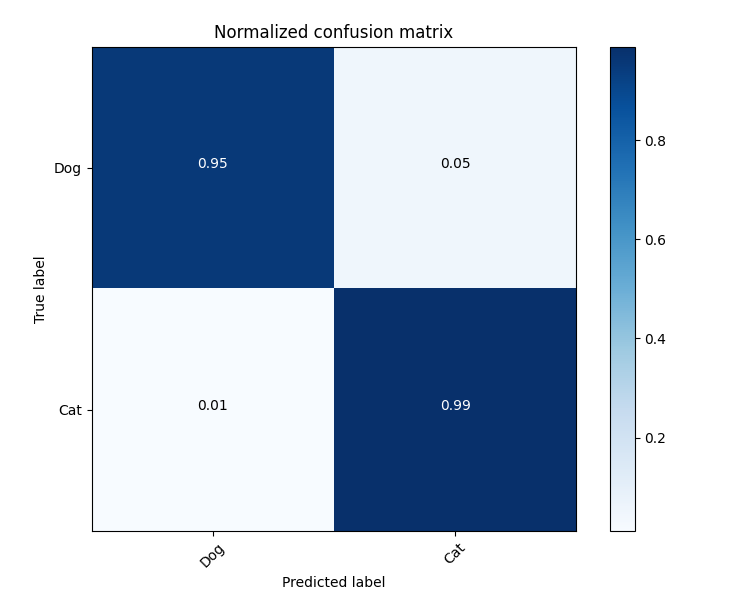
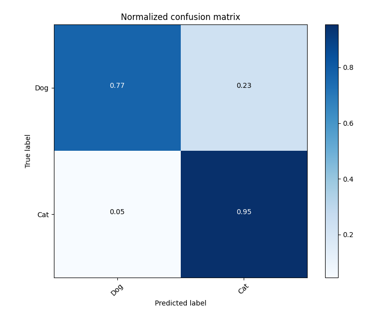

# Cat vs. Dog Classification by SRGAN

## Introduction
This repository is dedicated to the task of binary classification of cats and dogs using a Super-Resolution Generative Adversarial Network (SRGAN) to enhance image quality. The SRGAN approach is based on the paper by Ledig et al., which can be found [here](https://arxiv.org/abs/1609.04802).

The goal of this project is to compare the performance of a binary classification model trained on standard resolution images (128x128) against the same model trained on images that have been downscaled and then upscaled using SRGAN (32x32 to 128x128).

## Repository Structure
```
/
├── checkpoints/ # First model checkpoints and TensorBoard logs.
│ ├── model_A/ # Training results and checkpoints of model A.
│ └── model_B/ # Training results and checkpoints of model B.
├── cat_vs_dog_dataset/ # Original dataset for the classification task.
├── srgan/ # SRGAN implementation and related files.
│ ├── generated_train_images/ # Training images generated by SRGAN.
│ ├── generated_val_images/ # Validation images generated by SRGAN.
│ ├── train_srgan_samples/ # Sample images from SRGAN training.
│ ├── best_discriminator.pth # Checkpoint for the best SRGAN discriminator.
│ ├── best_generator.pth # Checkpoint for the best SRGAN generator.
│ ├── generate_srgan_data.py # Script to generate SRGAN images from 32x32 to 128x128.
│ ├── srgan.py # SRGAN model architecture.
│ ├── srgan_train_log.txt # Training log for SRGAN.
│ ├── srgan_train.py # Script for training the SRGAN model.
│ └── train_srganenerated.py # Script to train the binary classification model on SRGAN-generated images.
├── train.py # Script for training the binary classification model.
├── test.py # Script for testing the binary classification model.
└── README.md # Documentation for this repository.
```

## Getting Started

To use this repository for cat and dog classification:

1. Clone the repository to your local machine.
2. Download the Kaggle dataset from [Dogs vs. Cats](https://www.kaggle.com/c/dogs-vs-cats/data) and place it in the `cat_vs_dog_dataset` directory.
3. Run `train.py` to train the binary classification model (model A) on the original high-resolution images.
4. Execute the scripts within the `srgan` directory to train the SRGAN.
5. Run `generate_srgan_data.py` to generate SRGAN images from 32x32 to 128x128.
6. Execute `train_srganenerated.py` to train the binary classification model (model B) on the SRGAN-generated images.
7. Use the `test.py` to evaluate models A and B and compare their performances.

## Sample SRGAN Outputs
### Cat Images
| Low Resolution | High Resolution | SRGAN Generated |
|:--------------:|:---------------:|:---------------:|
|  |  |  |

### Dog Images
| Low Resolution | High Resolution | SRGAN Generated |
|:--------------:|:---------------:|:---------------:|
|  |  |  |


## Model Performance
### Model A
────────────────────────────────────────────────────────────────────────────────────────────────────────────────────────
      test_accuracy         0.9700000286102295
        test_auc            0.9967048764228821
         test_f1            0.9705072641372681
        test_loss           0.08344254642724991
     test_precision         0.9531410932540894
────────────────────────────────────────────────────────────────────────────────────────────────────────────────────────
### Model B
────────────────────────────────────────────────────────────────────────────────────────────────────────────────────────
      test_accuracy         0.8634666800498962
        test_auc            0.9538756012916565
         test_f1            0.8747247457504272
        test_loss            0.321264386177063
     test_precision         0.8071799278259277
────────────────────────────────────────────────────────────────────────────────────────────────────────────────────────

### Confusion Matrix for Model A



### Confusion Matrix for Model B




## Contributions

Contributions to this project are welcome. Please fork the repository, make your changes, and submit a pull request for review.

## Acknowledgements
- Credit to the authors of the SRGAN paper for their foundational work in image super-resolution.
- Thanks to Kaggle for providing the dataset for this classification challenge.

## Contact
For any queries or support such as model A and B weights and SRGAN-generated images, please open an issue in the repository or contact the repository maintainers directly.
